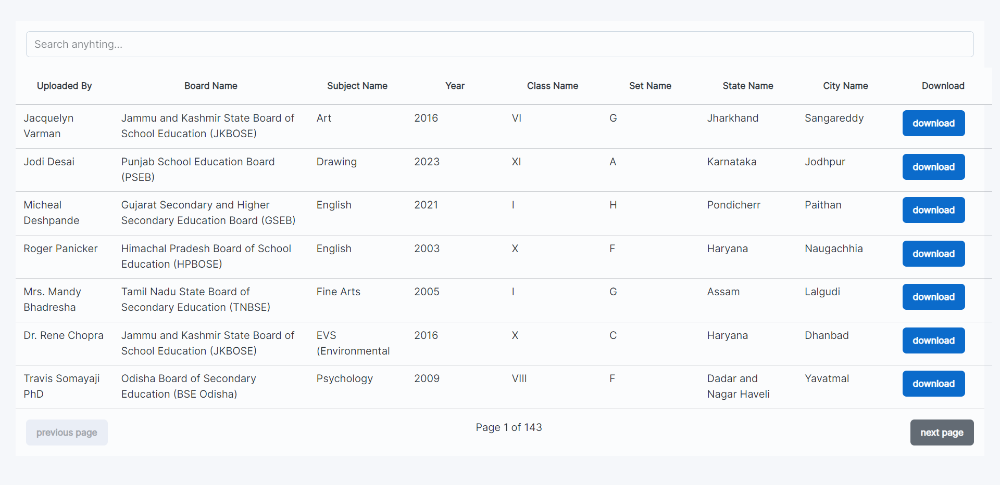

# Question Bank Project based on React JS + Strapi Js where user can share/submit their questions and also download 1000 of questions for free

## Screenshots

# Technologies Used in the Project

- React JS
- Strapi JS
- React Router DOM
- Tanstack Table 8
- axios
- Material UI - JOY UI

## Contact Me 📬

Feel free to reach out to me! You can find me on the following platforms:

- 🌐 **Website:** [www.toofanicoder.in](https://www.toofanicoder.in)
- 📧 **Email:** [toofanicoder333@gmail.com](mailto:toofanicoder333@gmail.com)
- 🐦 **Twitter:** [@toofani_coder](https://twitter.com/toofani_coder)
- 📷 **Instagram:** [@toofani_coder](https://www.instagram.com/toofani_coder)
- 👔 **LinkedIn:** [https://www.linkedin.com/in/subroto-biswas-%F0%9F%AA%90-011893135/](https://www.linkedin.com/in/https://www.linkedin.com/in/subroto-biswas-%F0%9F%AA%90-011893135/)

Let's connect and chat! 😊
